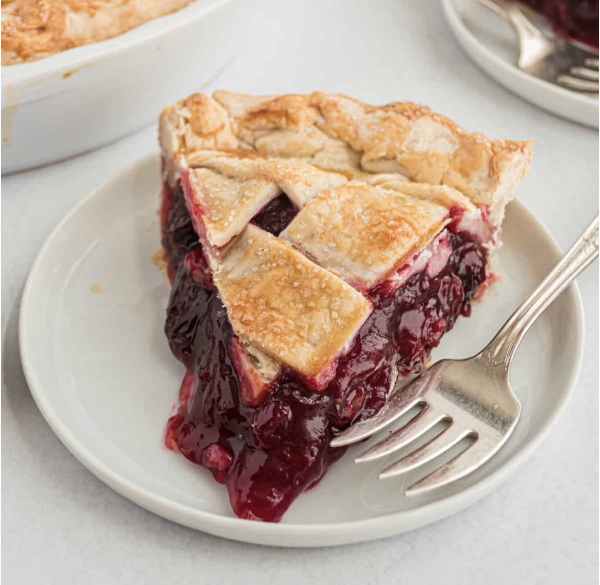

# classic cherry pie
*a timeless dessert with buttery crust and sweet-tart filling*

This classic cherry pie combines a flaky, golden crust with a perfectly balanced filling that's both sweet and tart. The result is a dessert that's been beloved for generations.

Start by preparing your pie dough with cold butter, flour, salt, and ice water. Work quickly to keep everything chilled, then divide into two portions for top and bottom crusts. Roll out the bottom crust and fit it into a 9-inch pie dish.

For the filling, you'll need about 4 cups of fresh or frozen pitted cherries. Toss them with sugar (about 3/4 cup), a tablespoon of lemon juice, 3 tablespoons of cornstarch, and a pinch of salt. Let this mixture sit for 15 minutes so the cherries release their juices.

Pour the cherry filling into your prepared crust, then dot with small pieces of butter. Cover with the top crust, crimping the edges to seal. Cut a few slits in the top to let steam escape.

Brush with an egg wash and sprinkle with coarse sugar for a beautiful golden finish. Bake at 425°F for 20 minutes, then reduce to 350°F and bake for another 30-40 minutes until the crust is golden and the filling bubbles through the vents.

Let cool completely before slicing to allow the filling to set properly.
