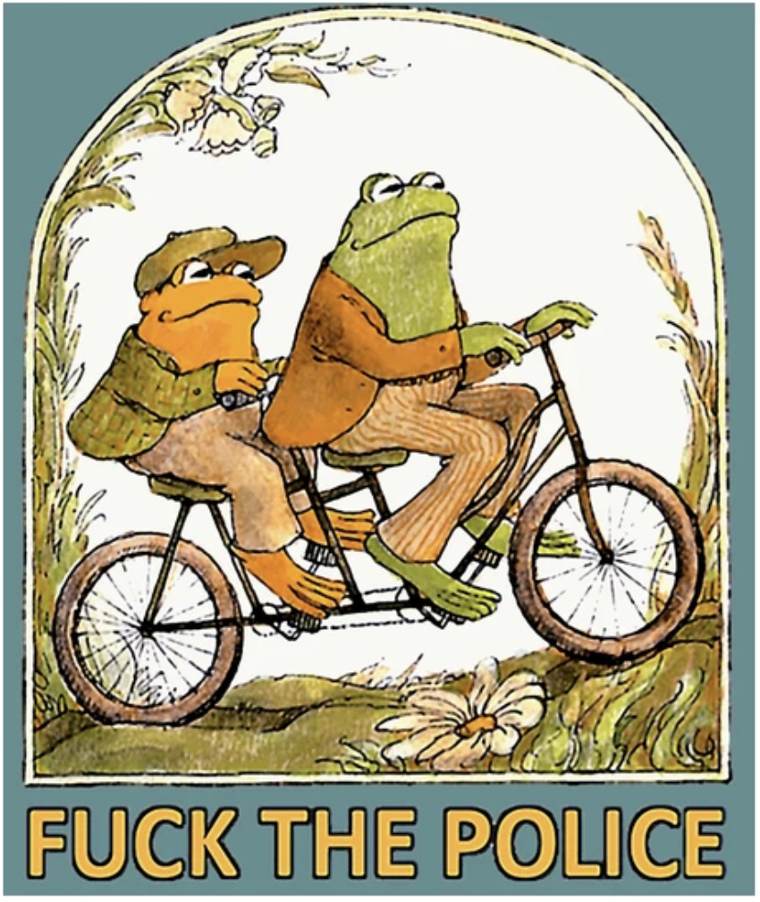

# test post
*this is just a test*

This is some test text, to see whether posts work properly. Ideally, there's not much structure, but since people like to do stupid shit, why not check out whether some basic formatting works?

## small title

Maybe a 

- bullet point list
- with a couple of items

Since we're going to test semantic search, perhaps this would be a good place to include a recipe for cherry pie or talk about craft beers. Who knows! 